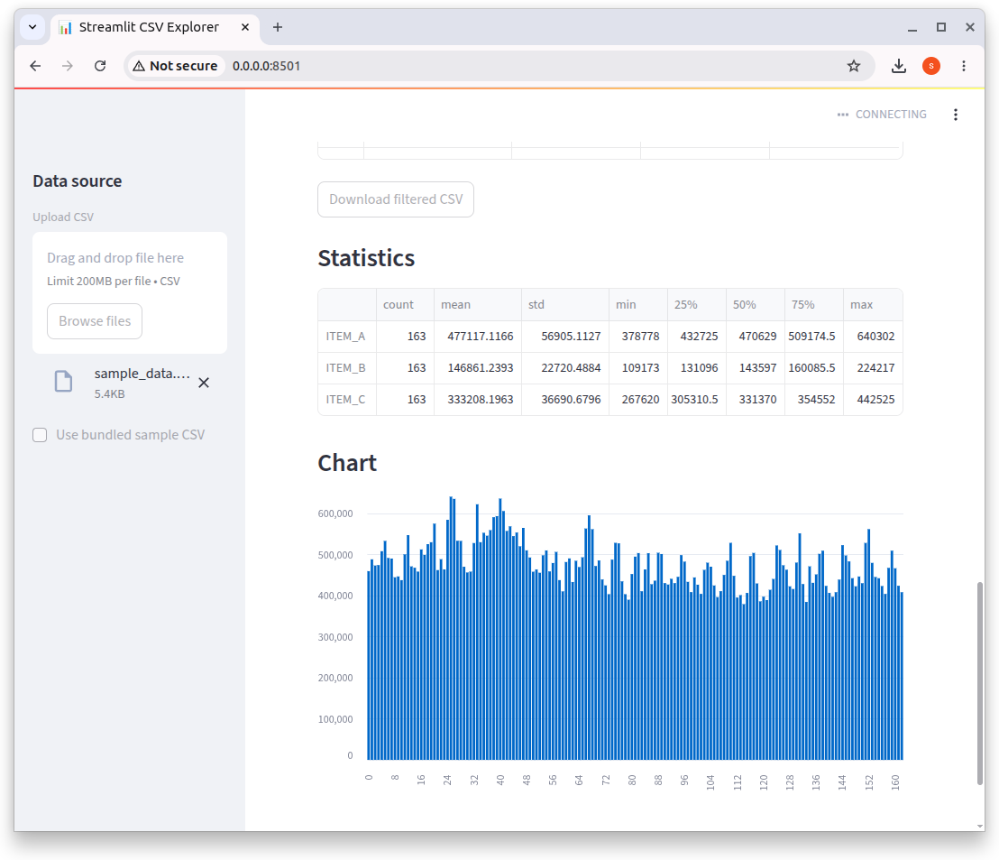

# [streamlit_project](https://github.com/europanite/streamlit_project "streamlit_project")

[](https://opensource.org/licenses/Apache-2.0)
[](https://www.python.org/)


[](https://github.com/europanite/streamlit_project/actions/workflows/lint.yml)
[](https://github.com/europanite/streamlit_project/actions/workflows/pytest.yml)
[](https://github.com/europanite/streamlit_project/actions/workflows/ci.yml)




## Requirements

- Docker
- Docker Compose

## Run

```bash
docker compose build
docker compose up
```

Open:

```text
http://localhost:8501
```

## Test

```bash
docker compose -f docker-compose.test.yml build
docker compose -f docker-compose.test.yml run --rm service_test
```

## Lint

```bash
docker compose -f docker-compose.test.yml run --rm --entrypoint /bin/sh service_test -lc 'ruff check /app /tests'
```

## Local development inside container

```bash
docker compose run --rm --entrypoint /bin/sh service
```
